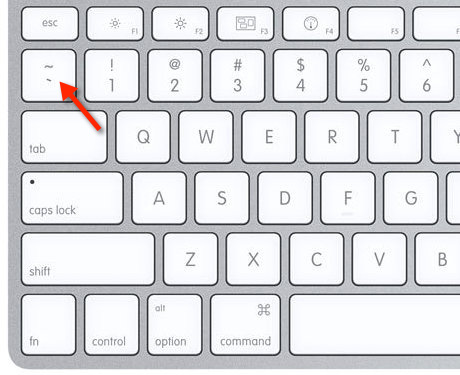

Github...


# 제목1


## 제목2


### 제목3


*강조* 해봅시다.

**두껍게** 글을 쓸 수 있어요.

~~취소선~~ 물결 2개를 사용하면 됩니다.


1. 목록이 있는 리스트
2. 목록이 있는 리스트
3. 목록이 있는 리스트 엔터치면 나가짐


* *누르고 space 하면 unordered list 순서가 없는 리스트
* 순서가 없는 리스트
  * 들여쓰기 됩니다
    * 쉽죠..?


[GOOGLE](https://google.com)


`**굵은**` 

`print("hello")` 글과 글 사이에 `print("hello")`를 넣으실 수 있습니다.


```python
print("hello")

여러 줄의 코드를 넣습니다..
```


```python
```


### 변수

> 변수란 데이터를 담는 그릇과 같은 것이다.


### 수평선 (---)

---




